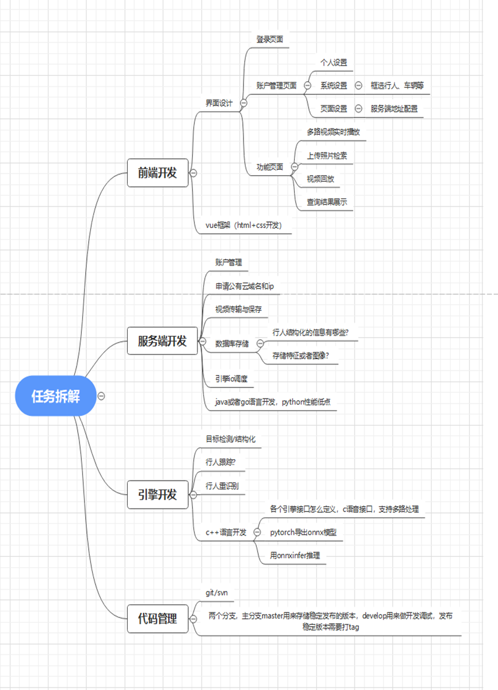

# 第一次实验室会议纪要

## 1. 系统运行环境与展示平台

-   系统初步在实验室 4080 主机运行，后移植到服务器。
-   建立通用系统平台，兼容未来实验室成果展示项目。

## 2. 明确分工

1. **产品调研与接口定义**
    - 由两位博士师兄统筹，划分成员任务。
2. **技术支持**
    - 几位老师带队，提供灵活帮助和指导。
3. **前端开发**
    - 朱子建和兰翔负责，学习使用 Vue 制作操作界面。
4. **后端开发**
    - 涂玉华、彭景、王静、裴跃负责，学习使用 Java 搭建系统。

## 3. 本周任务

-   学习技术语言，等待博士师兄的产品调研结果。
-   待调研结束后，开始具体工作。

