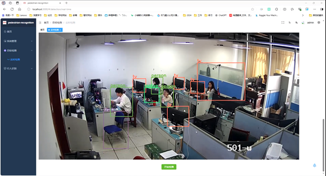
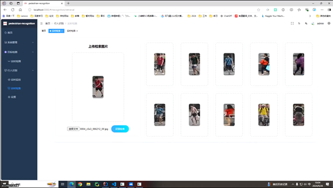

# 第十一次会议

## 会议时间
2024.9.28

## 参会人员
刘一敏、李坤袁、涂玉华、彭景、裴跃、王静、兰翔、朱子建

## 会议摘要

### 1. 解决了前后端交互
进行了前端功能展示，已初步实现了前后端交互处理，处理好了接口问题，实现了前后端连接，能够在前端进行操作，并获取后端相关技术支持，最终在前端展现出响应结果，但还需要进一步进行优化，提高模型效率和系统稳定性。

### 2. 实时监测模块
  
在上周的工作中，我们成功解决了之前遗留的一系列问题，并顺利实现了基础的监测功能。现在，这些功能已经能够完全通过前端进行操作，同时自动调用后端相应算法，共同完成各项任务。我们的系统已经初步具备了完整的功能，但监测的实时性还有待提高。为了提升系统操作体验，我们计划进一步优化监测机制，确保后端数据能够更加及时、准确地反馈给前端。我们也意识到界面布局尚显粗糙，不够美观和易用。因此，后续我们将重点对界面进行改进，提升其整体视觉效果和操作体验。

### 3. 行人识别模块
  
成功从前端上传检索图片，由后端接收，并将处理好的结果传回前端，全过程依赖后端相应算法，但相应操作全部可在前端完成，基础功能已能够正常实现，在后端方面，我们将重点优化模型，以提高检索能力的效率和准确性。通过不断改进检索模型，我们期望能够更快地返回更精确的检索结果，满足高效检索的需求。在前端方面，我们也将着手改进界面设计，使其更加美观、易用。我们将增加行人检索增加相似度和排序编号，优化布局和交互体验。

## 会议待办
1. 优化实时监测系统，增强其稳定性。
2. 进一步美化前端界面，完善布局。
3. 采取更为高效的检索模型，提高检索速度。
4. 行人检索增加相似度和排序编号进行更加直观的展示。

