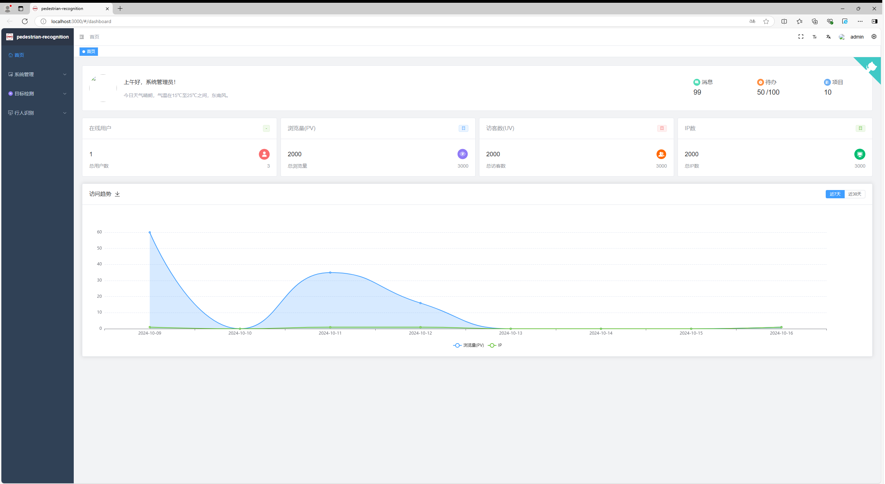
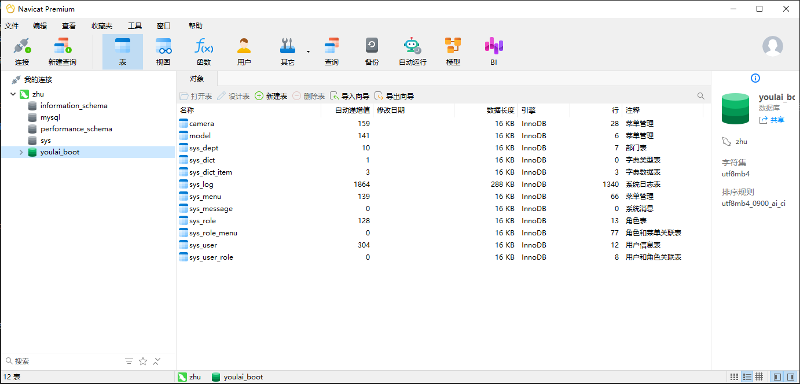
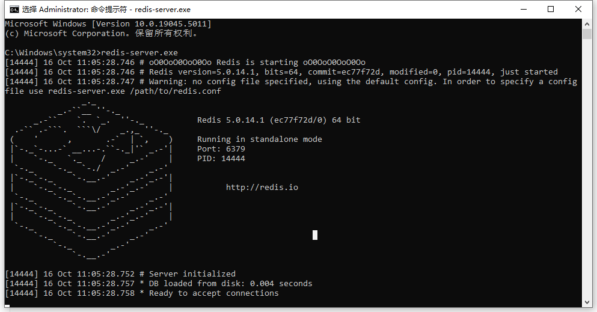
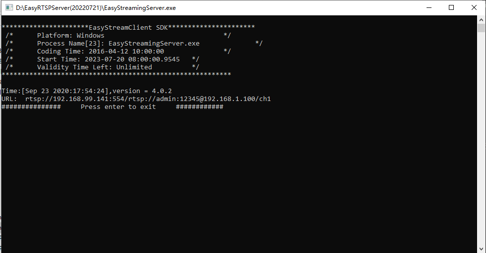
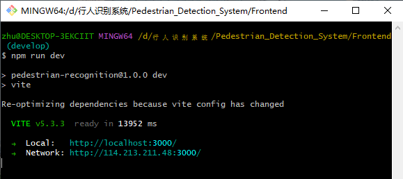

# 行人跟踪识别系统

-  本项目旨在实现一个行人跟踪识别系统，主要包括行人检测、行人跟踪、行人属性识别、行人重识别等功能，以及前端展示和后端管理功能。  
    

各文件夹说明：

-   设计文档以及会议记录见 `Documents/` 文件夹
-   前端代码见 `Frontend/` 文件夹
-   后端代码见 `Backend/` 文件夹

## 基础配置
-  Navicat Premium 
数据库开发工具，连接 MySQL 数据库(从/Backend/sql/youlai_boot.sql中导入)和 redis 数据库(redis数据库需要使用命令redis-server.exe运行)  
  

-   nodejs>= 18（其中 20.6.0 版本不可用）
开源与跨平台的 JavaScript 的运行环境 能够使得javascript脱离浏览器运行
-   JDK
java编译环境，本系统使用JDK17
-   EasyRTSPServer
本地模拟视频流(直接运行安装目录下的EasyStreamingServer.exe文件)
如需配置自己的模拟视频流，需要在安装目录下新建YourVideo.txt写入YourVideo.MP4，并将对应视频放入当前目录，同时同步到数据库  

-   webrtc-streamer
访问摄像机视频流(直接运行安装目录下的webrtc-streamer.exe文件)  

## 前端


参考前端地址：[youlaitech/vue3-element-admin: 🔥 基于 vue3 + vite5 + typescript + element-plus 构建的后台管理前端模板(配套后端源码),vue-element-admin 的 vue3 版本。 (github.com)](https://github.com/youlaitech/vue3-element-admin)

### 前端运行所需环境及运行方法：
1. 文件结构 
```bash
/Frontend
│
├── /mock               # Mock service for simulating backend interactions
│   ├── /src            # Source folder for mock services
│   │   ├── /api        # API interface definition files
│   │   ├── /view       # Code for feature interfaces
│   │   │   ├── /system # Code for system basic functionality interfaces
│
├── .env.development    # Configuration file for development environment
                        # Contains port configuration and mock service enable/disable flag (VITE_MOCK_DEV_SERVER)
```

2. 运行命令：
  ```bash
  cd Frontend            # 切换目录
  npm install pnpm -g    # 安装 pnpm
  pnpm install           # 安装依赖 
  pnpm run dev           # 启动运行
  ```


## 后端

参考后端地址：[haoxianrui/youlai-boot: 🌈 基于 Java 17 + Spring Boot 3 + Spring Security 6 + Vue 3 + Element-Plus 构建的前后端分离单体权限管理系统。 (github.com)](https://github.com/haoxianrui/youlai-boot)

### 后端运行所需环境及运行方法：
1. 文件结构 
```bash
/Backend
│
├── /sql                                  # SQL scripts for database initialization
│   ├── youlai_boot.sql                   # Script for creating database, table structures, and initializing basic data
│
├── /src
│   ├── /main
│   │   ├── /java/com/youlai/system       # Main functionality code
│   │   │   ├── /controller               # Controller layer
│   │   │   ├── /converter                # MapStruct converters
│   │   │   ├── /event                    # Event handling
│   │   │   ├── /handler                  # Handlers
│   │   │   ├── /model                    # Model layer
│   │   │   ├── /mapper                   # Database access layer (DAOs)
│   │   │   ├── /service                  # Business logic layer
│   │   │   ├── SystemApplication.java    # Backend project starter file; 
│   │   │                                 # After running the backend, access API docs at:http://localhost:8989/doc.html
│   │   ├── /resources
│   │   │   ├── application-dev.yml       # Server port configuration
│
├── pom.xml                               # Maven configuration file for Java environment
```
2. 运行命令： 
```
run SystemApplication.java
```